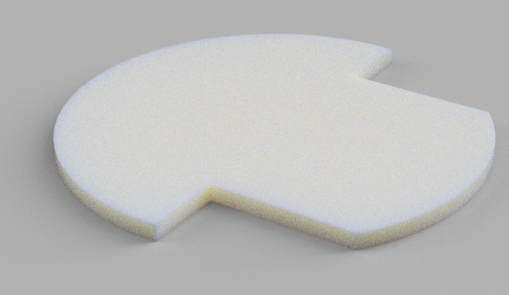
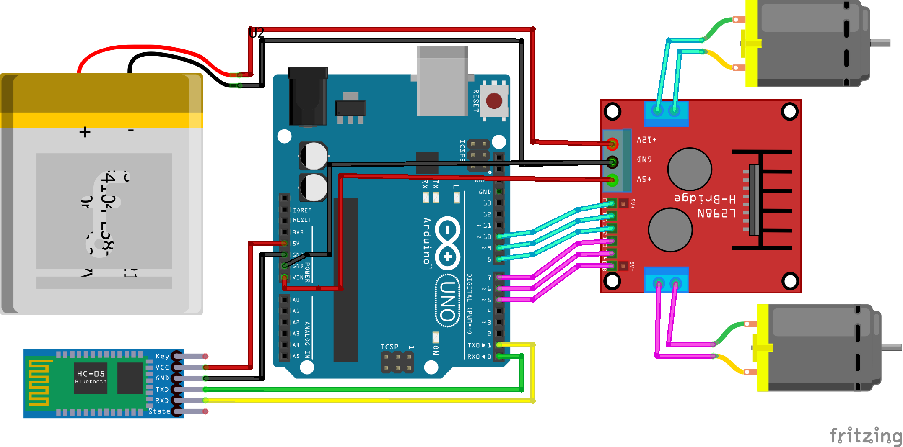
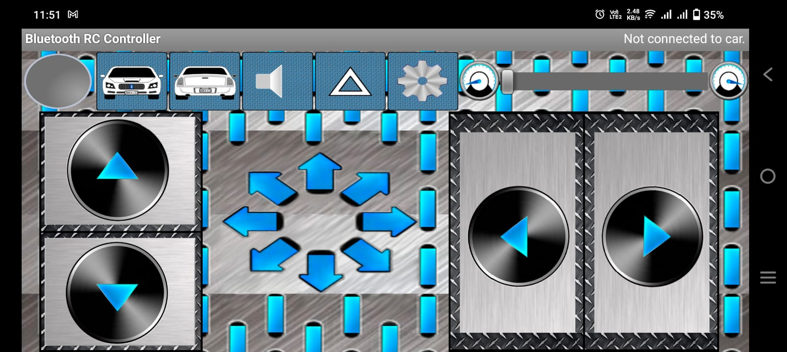

# Bluetooth-Controlled RC Car

Welcome to the **Bluetooth-Controlled RC Car** repository! This project contains all the necessary resources to build and operate an RC car using an Arduino-based system and a Bluetooth Android app.

## 📂 Repository Structure

```
RC_Car/
│-- 📁 Body_Design/
│   ├── body_design_1.png
│   ├── body_design_2.png
│-- 📁 Circuit_Diagram/
│   ├── circuit_diagram.png
│-- 📁 Android_App/
│   ├── app_interface.png
│   ├── Bluetooth_RC_Car.apk  (Developed by Andi.Co)
│-- 📁 Arduino_Code/
│   ├── rc_car_code.ino
│-- 📁 Robotics_Basics/
│   ├── robotics_slide.pdf
│-- README.md
```

---

## 🚗 Overview
This project showcases a **Bluetooth-controlled RC car** that can be operated using an Android app. The car's movements are controlled via an **Arduino** microcontroller, which communicates with the app using a Bluetooth module.

### ✨ Features
- **Wireless Control**: Use a smartphone app to control the car.
- **Easy Assembly**: Simple circuit and body design for DIY enthusiasts.
- **Arduino-Based**: Open-source and easily customizable.
- **Bluetooth Connectivity**: Seamless communication between app and car.

---

## 📁 Folder Descriptions

### 1️⃣ Body_Design/
This folder contains the **3D model and images** of the RC car's body design.



### 2️⃣ Circuit_Diagram/
This folder contains the **wiring and circuit diagram** needed to build the RC car.


### 3️⃣ Android_App/
This folder contains the **Android application (Bluetooth RC Car by Andi.Co)** for controlling the car.


### 4️⃣ Arduino_Code/
This folder includes the **Arduino code** necessary to operate the RC car.

### 5️⃣ Robotics_Basics/
This folder contains an **introductory slide** on robotics basics.

---

## 🔧 Hardware Requirements
- **Chassis for the car frame**
- **1 Arduino Uno**
- **2 DC Motors**
- **2 Mounts**
- **2 Wheels**
- **1 Ball Castor**
- **1 L298N Motor Driver**
- **1 HC-05 Bluetooth Module**
- **1 3Cell 11.1V Li-po Battery**
- **Jumper Wires**
- **Smartphone with a Bluetooth controller app**

---

## 📲 App Installation
1. Download the `Bluetooth_RC_Car.apk` from the `Android_App/` folder.
2. Install it on your Android device.
3. Connect to the **HC-05 Bluetooth module**.
4. Control your car wirelessly!

---

## 🚀 Getting Started
1. Assemble the car using the **circuit diagram**.
2. Upload the **Arduino code** (`Bluetooth_Controlled_RC_Car.ino`) to your Arduino board.
3. Install the **Android app** and connect to the car.
4. Start driving!


---

## ❤️ Acknowledgments
- **Bluetooth RC Car App**: Developed by [Andi.Co](https://play.google.com/store/apps/dev?id=XXXXXXXX).
- Inspired by open-source Arduino projects.
